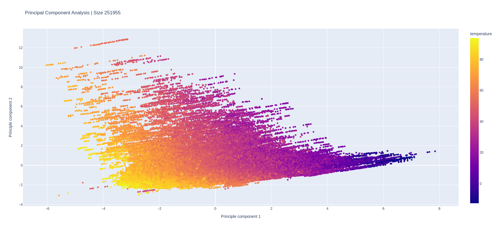
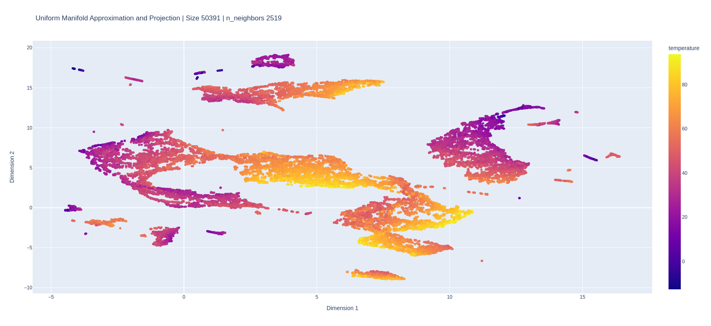
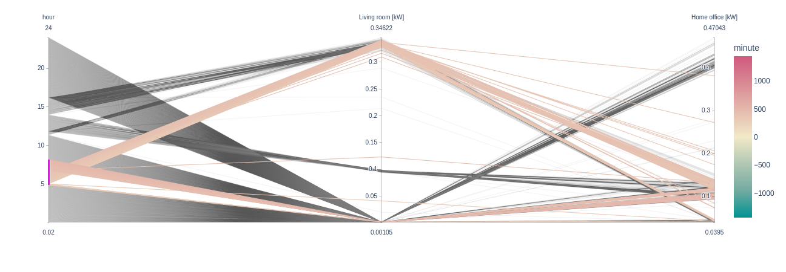
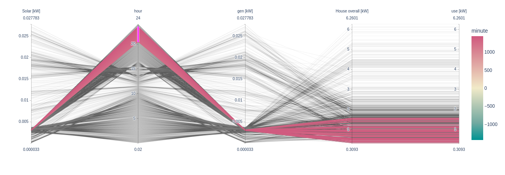
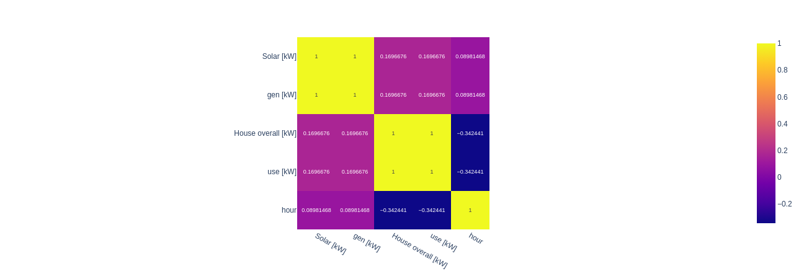
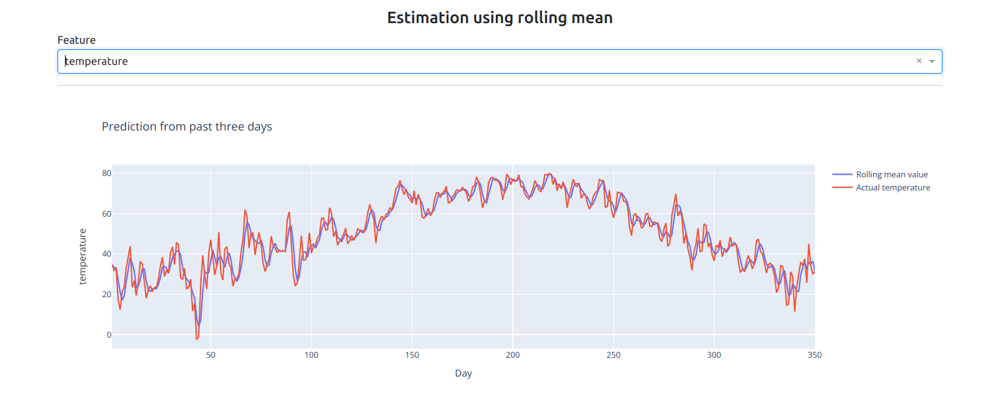

# PowerViz
Energy Consumption Visualization Framework for Smart Home. Build with 
- [Plotly dash](https://dash.plotly.com/)
- [Smart Home Dataset with weather Information](https://www.kaggle.com/datasets/taranvee/smart-home-dataset-with-weather-information?select=HomeC.csv)

# Table of Contents
- [How to start the application](#how-to-start-the-application)
- [Features](#features)
    - [Dimensionality reduction](#dimensionality-reduction)
        - [PCA](#principal-component-analysis-pca)
        - [t-SNE](#t-distributed-stochastic-neighbor-embedding-t-sne)
        - [UMAP](#uniform-manifold-approximation-and-projection-umap)
    - [Parallel coordinates plot](#parallel-coordinates-plot)
    - [Feature correlation](#feature-correlation)
    - [Rolling mean](#rolling-mean)
- [Contributors](#contributors)
- [Documents](/docs/)
    - [Project proposal](/docs/PDF/ProjectProposal.pdf)
    - [Report]()

## How to start the application
1. Clone the repo:
```bash
git clone https://github.com/suvambasak/PowerViz.git
```
2. Extract the file `HomeDHM.zip` inside dataset. Path should be: `/home/suvam/Projects/PowerViz/dataset/HomeDHM.csv`
3. Create virtual environment
```bash
virtualenv .venv
```
```bash
. .venv/bin/activate
```
4. Install dependencies  from `requirements.txt`

```bash
pip install -r requirements.txt
```
5. Start the application
```bash
python app.py
```

## Features

### Dimensionality reduction

#### Principal component analysis (PCA)

</center>

#### t-Distributed Stochastic Neighbor Embedding (t-SNE)

</center>

#### Uniform Manifold Approximation and Projection (UMAP)

</center>

</center>

### Parallel coordinates plot

<center>

</center>

<center>

</center>

### Feature correlation
<center>

</center>

###  Rolling mean

</center>

## Contributors
- [Suvam Basak](https://github.com/suvambasak)
- [Akshan Agrawal](https://github.com/akshanagrawal)
- [Akshay Gupta](https://github.com/akshay-gupta123)
- [Anshumann](https://github.com/anshmn)
- [Antreev Brar](https://github.com/antreev-brar)